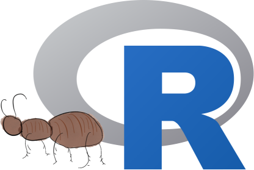

# tracerer

Branch|[](https://travis-ci.org)|[](https://www.appveyor.com)|[](https://www.codecov.io)
---|---|---|---
master|[](https://travis-ci.org/richelbilderbeek/tracerer)|[](https://ci.appveyor.com/project/richelbilderbeek/tracerer/branch/master)|[](https://codecov.io/github/richelbilderbeek/tracerer/branch/master)
develop|[](https://travis-ci.org/richelbilderbeek/tracerer)|[](https://ci.appveyor.com/project/richelbilderbeek/tracerer/branch/develop)|[](https://codecov.io/github/richelbilderbeek/tracerer/branch/develop)

[](https://zenodo.org/badge/latestdoi/114987588)

`tracerer`, 'Tracer for R' is an R package 
to work with BEAST2 output files. 



`tracerer` is part of the [babette](https://github.com/richelbilderbeek/babette) package suite:

 * [beautier](https://github.com/richelbilderbeek/beautier) creates BEAST2 input (`.xml`) files.
 * [beastier](https://github.com/richelbilderbeek/beastier) runs BEAST2
 * [tracerer](https://github.com/richelbilderbeek/tracerer) pastes BEAST2 output (`.log`, `.trees`, etc) files.

Use [BEASTmasteR](https://github.com/nmatzke/BEASTmasteR) for tip-dating analyses using fossils as dated terminal taxa.

Use [RBeast](https://github.com/beast-dev/RBeast) for other things.

## Example

```{r}
library(tracerer)

# Obtain an example log file its name
filename <- get_tracerer_path("beast2_example_output.log")

# Parse that log file
beast_log_full <- parse_beast_log(filename)

# Remove the burn-in
beast_log <- remove_burn_ins(
  beast_log_full,
  burn_in_fraction = 0.1
)

# Calculates the effective sample sizes of all parameter estimates
esses <- calc_esses(beast_log, sample_interval = 1000)
```

## Installation

Install `tracerer` in `R` using `devtools`:

```{r}
devtools::install_github("richelbilderbeek/tracerer")
```

## FAQ

See [FAQ](faq.md)

## There is a feature I miss

See [CONTRIBUTING](CONTRIBUTING.md), at `Submitting use cases`

## I want to collaborate

See [CONTRIBUTING](CONTRIBUTING.md), at 'Submitting code'

## I think I have found a bug

See [CONTRIBUTING](CONTRIBUTING.md), at 'Submitting bugs' 

## There's something else I want to say

Sure, just add an Issue. Or send an email.

## External links

 * [BEAST2 GitHub repository](https://github.com/CompEvol/beast2)
 * [Tracer GitHub repository](https://github.com/beast-dev/tracer)

## References

Article about `babette`:

 * Bilderbeek, Richel J.C., Etienne, Rampal S., "babette: BEAUti 2, BEAST2 and Tracer for R". bioRxiv 271866; doi: https://doi.org/10.1101/271866

FASTA files `anthus_aco.fas` and `anthus_nd2.fas` from:
 
 * Van Els, Paul, and Heraldo V. Norambuena. "A revision of species limits in Neotropical pipits Anthus based on multilocus genetic and vocal data." Ibis.

